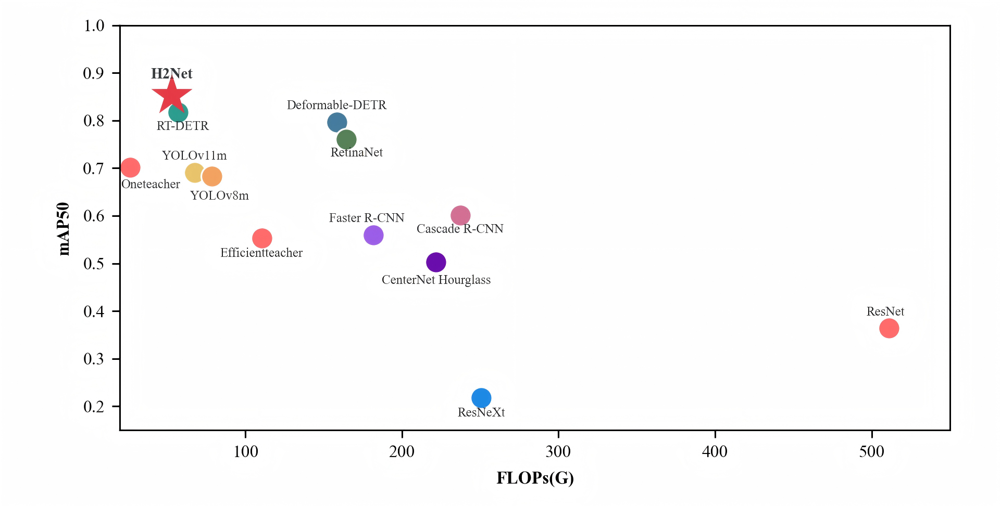

# H2Net：Enhanced Object Detection in Water Disaster Scenarios via Orthogonal Channel Attention and Wavelet Fusion
[](https://pytorch.org/)
[](https://github.com/ultralytics/ultralytics)
[](https://doi.org/10.1007/s00371-025-04294-w)
[](https://link.springer.com/article/10.1007/s00371-025-04294-w)

> **论文信息**：已正式发表于《The Visual Computer》(2026, 42: 80)  
> 🔗 论文链接：[https://link.springer.com/article/10.1007/s00371-025-04294-w](https://link.springer.com/article/10.1007/s00371-025-04294-w)  
> 📅 接收日期：2025-06-10 | 录用日期：2025-11-23 | 发表日期：2025-12-19

---

## 项目简介
H2Net 是一款基于 RT-DETR 改进的高效目标检测模型，专为水域灾害场景设计。针对水面反光、波浪干扰、目标尺度小、姿态多变等核心挑战，通过引入正交通道注意力机制（OCA）和 Haar 小波融合模块（HWConv），在保证实时性的同时，显著提升了被困人员、救援设备等目标的检测精度，为水域灾害应急救援提供技术支撑。

---

## 核心创新与性能亮点
### 🔥 核心创新
1. **OCA 正交通道注意力机制**：基于 Gram-Schmidt 正交化，抑制水面反光/波浪噪声，降低通道特征冗余，增强小目标特征表达
2. **Haar 小波融合模块（HWConv）**：对数级扩展感受野，高效融合多尺度频域特征，提升极小目标（如部分淹没人员）检测能力
3. **轻量化设计**：在 RT-DETR 基础上优化骨干网络，实现精度与效率的平衡

### 📊 关键性能（SeaDronesSee-V2 数据集）
| 指标                | 数值       | 对比基线（RT-DETR）提升 |
|---------------------|------------|--------------------------|
| mAP50               | 85.2%      | +3.5%                    |
| mAP50:95            | 52.0%      | +1.6%                    |
| 召回率（Recall）    | 82.1%      | +2.2%                    |
| 精确率（Precision） | 92.1%      | +0.7%                    |
| 参数量（Params）    | 15.3M      | -22.7%（减少4.5M）       |
| 计算量（FLOPs）     | 53.2G      | -6.6%（减少3.8G）        |
| 帧率（FPS）         | 83 FPS     | +1 FPS                   |

### 🎯 跨域泛化能力
在 VisDrone2019-DET 跨域数据集上验证，mAP50 达 48.2%（+0.8%），召回率 46.7%（+0.7%），展现出对复杂场景的强适应性。

  
*H2Net 在 mAP50 与计算效率的平衡上优于主流模型（测试环境：NVIDIA RTX 4060 Ti，输入尺寸 640×640）*

---

## 环境配置

### 硬件要求
- GPU: NVIDIA GeForce RTX 4060Ti 16G（或同等级别及以上）
- RAM: ≥32GB（推荐）
- 硬盘：≥50GB 空闲空间（用于存储数据集和预训练权重）

### 软件环境
```bash
# 1. 创建虚拟环境
conda create -n h2net python=3.10
conda activate h2net

# 2. 安装核心依赖（PyTorch + CUDA 12.1）
pip install torch==2.2.1+cu121 torchvision==0.17.1+cu121 -f https://download.pytorch.org/whl/torch_stable.html

# 3. 安装辅助依赖
pip install pywavelets==1.5.0 opencv-python==4.9.0.80 scikit-learn==1.4.0
pip install ultralytics==8.0.201 tqdm==4.66.2 pandas==2.2.1
```

---

## 快速开始

### 1. 数据集准备
#### 支持数据集
- 主数据集：[SeaDronesSee Object Detection v2](https://cloud.cs.uni-tuebingen.de/index.php/s/ZZxX65FGnQ8zjBP)（Compressed Version）
- 跨域数据集：[VisDrone2019-DET](https://github.com/VisDrone/VisDrone-Dataset)

#### 数据集结构
官方数据集为 COCO 格式标注，本项目提供 YOLO 格式标注下载：
```bash
# YOLO格式标注下载（百度网盘）
链接: https://pan.baidu.com/s/1TJwEHOmWDOLJ7O_fBghXrg?pwd=1qe1
```
下载后按以下结构组织：
```TEXT
datasets/
├── drowning_person_yolo/  # SeaDronesSee-V2 数据集
│   ├── images/
│   │   ├── train/  # 训练集图像（14,227张）
│   │   └── val/    # 验证集图像
│   └── labels/
│       ├── train/  # 训练集标注（YOLO格式）
│       ├── val/    # 验证集标注
│       └── classes.txt  # 类别文件（5类：swimmer, boat, motorboat, life_saving_appliances, navigation_mark）
└── VisDrone2019_yolo/     # VisDrone2019-DET 数据集
    ├── images/
    │   ├── train/
    │   └── val/
    └── labels/
        ├── train/
        └── val/
```

#### 配置文件
使用 `datasets/A_drowning_person.yaml` 配置数据集路径，示例：
```yaml
path: ./datasets/drowning_person_yolo  # 数据集根目录
train: images/train
val: images/val
nc: 5  # 类别数
names: ['swimmer', 'boat', 'motorboat', 'life_saving_appliances', 'navigation_mark']
```

### 3. 模型训练
```bash
# 基础训练命令（使用默认配置）
python3 ./train.py
```

### 4. 模型验证
```bash
# 基础验证命令
python3 ./val.py
```


## 代码结构
```
H2Net/
├── datasets/                                   # 数据集配置
│   └── A_drowning_person.yaml
├── docs/                                       # 文档和结果图
├── my_cfg/                                     # 模型配置文件
│   ├──H2Net.yaml         # H2Net 模型配置文件
│   └──rtdetr-r18.yaml                          # RT-DETR-R18 模型配置文件
├── train.py                                    # 训练脚本
└──  val.py                                      # 验证脚本
```

---

## 引用声明
如果本项目或论文对你的研究有帮助，请引用以下格式：
```bibtex
@article{chen2026h2net,
  title = {H2Net: enhanced object detection in water disaster scenarios via orthogonal channel attention and wavelet fusion},
  author = {Chen, Wenzhuo and Dai, Wantao and Wang, Fan and Jin, Long and Zhao, Peiying},
  journal = {The Visual Computer},
  volume = {42},
  number = {80},
  year = {2026},
  doi = {10.1007/s00371-025-04294-w},
  url = {https://link.springer.com/article/10.1007/s00371-025-04294-w}
}
```

---

## 致谢
本研究得到以下项目支持：
- 中央高校基本科研业务费（No. ZY20250104）
- 国家重点研发计划（Nos. 2024YFB2908803-01, 2024YFB29008804-01）
- 河北省创新创业教育教学改革研究与实践项目（No. 2023cxcy240）
- 大学生创新创业训练计划项目（No. S202511104077）
---

## 联系方式
- 第一作者：Wenzhuo Chen（wenzhuochen@ncist.edu.cn）
- 代码维护：Fan Wang（github@wangfan040803）
- 仓库地址：[https://github.com/wangfan040803/H2Net](https://github.com/wangfan040803/H2Net)

欢迎Star🌟和Fork，如有问题请提交Issue或联系作者！
